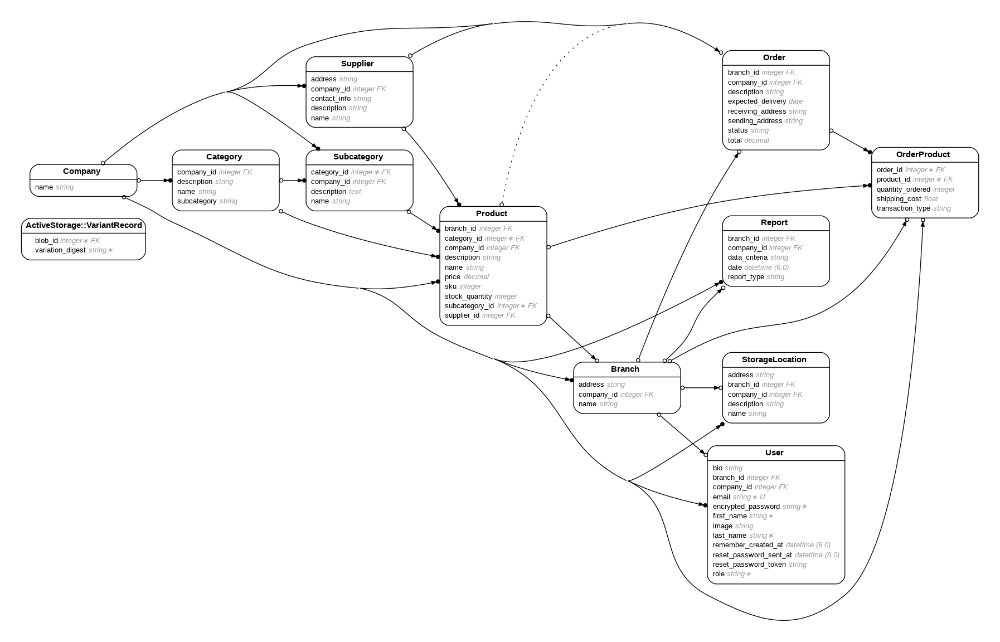

# Invy is an app that helps small retail companies keep track of shipping, product inventory, sales, and purchasing

Depending on their assigned roles, users have CRUD abilities for inventory products, orders, supplier profiles, category & subcategory management, and user profiles. Admins have full CRUD permissions, Managers have slightly fewer, and Staff have the least.

The app will eventually be able to accept barcode scanning inputs to further automate inventory management processes like sales, restocks, and audits.

More features to come:
- Ingestion of external transaction/shipping information
- Connectivity with Stripe payments
- Analytics for financial and inventory information, including restock alerts
- Specialization for perishable products - will alert you when food is about to expire/has already expired
- Possible automated tracking/notifications for recalled products

## !!!Important!!!! 
### A note about orders#edit:
- 'Delete' functionality will be added to the orders#edit page for individual order_products, but for now that should be done from the order#show page.
-  If you intend to update the information for a pre-existing order_product, for now you should delete it from the #show view first, then re-add it with the correct information as a new order_product.
##
### Dependencies

* The front-end is made with Bootstrap, StartBootstrap's SB-Admin-2 template especially, and heavily uses DataTables
* Several edit fields are dependent on the Google Maps API, and are currently coded through an ENV_fetch call. You will need your own key to get those pages to work properly.

### Installing

* Clone this repository, `bundle install`, `rake db:migrate`, and have fun.

### Executing the program

* `Rails server` and `bin/dev` will launch the live preview
* `Dev.rake` contains several `sample_data` tasks that have been partitioned to save memory during deployment to production. Running these tasks will provide a good demo of the app's functionality.
* Here's the entity relationship diagram as of 12/13/2023:

## Authors

Calvin Armstrong

## Version History

* 0.1
    * Initial Release

## Acknowledgments

* [awesome-readme](https://github.com/matiassingers/awesome-readme)
